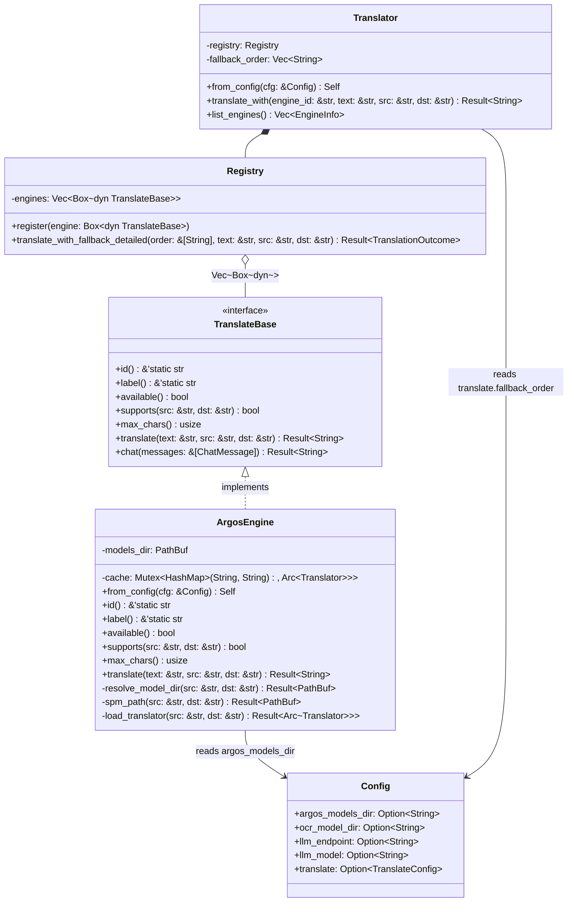
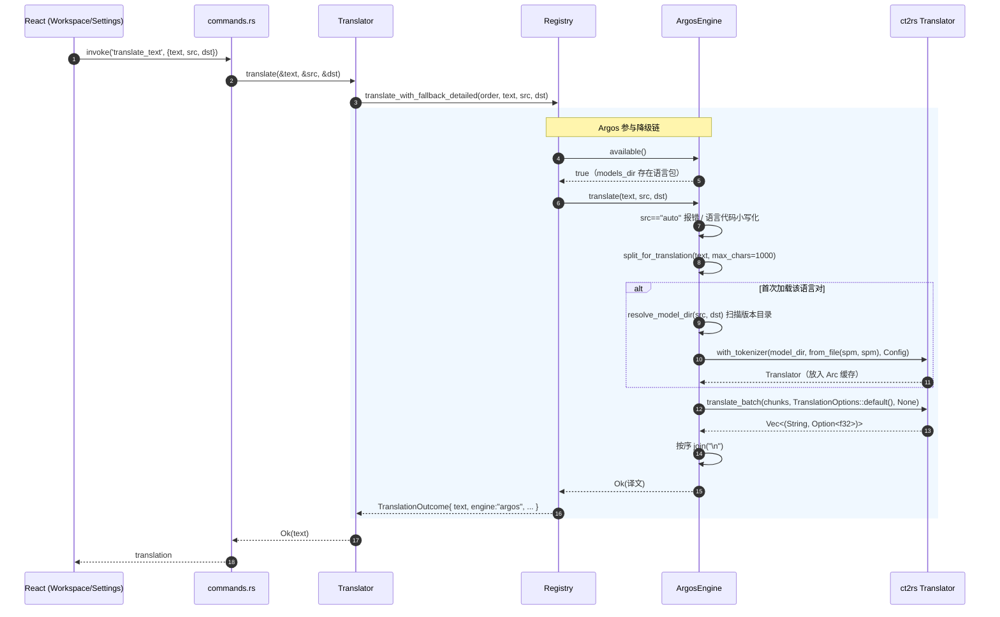

# Argos 离线翻译引擎 — 增量集成设计（A′ 方案：ct2rs 纯 Rust）

> 适用范围：`fullscene-ocr-translator` 仓库（Rust workspace + Tauri 2 + React/Vite）。
> 本文档是**增量设计**：仓库已有完整翻译引擎框架（`TranslateBase` trait + Registry 降级链），本设计只新增 Argos 离线引擎这一环。
> 关联文档：`docs/项目规范.md`（唯一事实来源，改代码必同步）。

---

## 一、实现方案

### 1.1 技术选型确认

**crate：`ct2rs`（CTranslate2 官方 Rust 绑定，0.10.x）**

- crates.io 已发布（当前 0.10.x），维护活跃（unprodstudio/ctranslate2-rs 系）。
- Windows 支持预编译二进制：**构建期需要 CMake**，运行期零 Python 依赖，完全满足 A′ 方案。
- 特性 `sentencepiece` 提供 SentencePiece 分词器封装（`ct2rs::tokenizers::sentencepiece::Tokenizer`）。

**核心 API 签名（已查证 docs.rs ct2rs 0.10.0）：**

```rust
// 加载模型 + 分词器
pub fn Translator::with_tokenizer<U: AsRef<Path>, T: Tokenizer>(
    path: U,                 // 模型目录（含 model.bin + config.json）
    tokenizer: T,            // 分词器实例
    config: &Config,         // ct2rs 运行配置（设备/线程等），默认 CPU
) -> Result<Translator<T>>;

// SentencePiece 分词器：接受【两个独立 spm 文件路径】
pub fn tokenizers::sentencepiece::Tokenizer::from_file<U: AsRef<Path>, V: AsRef<Path>>(
    src: U,                  // source.spm 路径
    target: V,               // target.spm 路径
) -> Result<Tokenizer>;

// 批量翻译
pub fn translate_batch<U, V, W>(
    &self,
    sources: &[U],                              // 待译文本数组（批量）
    options: &TranslationOptions<V, W>,         // 默认即可
    callback: Option<&mut dyn FnMut(GenerationStepResult) -> Result<()>>,
) -> Result<Vec<(String, Option<f32>)>>;        // (译文, 得分)
```

### 1.2 关键设计点确认：单 sentencepiece.model 如何适配双 spm 参数

**问题**：Argos `.argosmodel` 解压后只有 `sentencepiece.model` 一个分词器文件，而 `ct2rs` 的 `Tokenizer::from_file(src, target)` 需要两个文件路径。

**查证结论（本设计的核心决策）**：

1. `from_file` 只要求两个**文件路径参数**，底层按源/目标两侧分别加载 SentencePiece 模型，**不校验两个路径是否不同**。
2. Argos 模型是 OpenNMT 风格的**共享词表模型**——`model/` 目录下的 `shared_vocabulary.json` 即为共享词表的证据，源语言与目标语言**共用同一个 SentencePiece 模型**。
3. 因此：**`Tokenizer::from_file(sentencepiece_model, sentencepiece_model)` 复用同一路径完全可行**。
   - 无需复制文件、无需临时目录、无需修改语言包结构。
   - 模型目录直接指向 `{from}_{to}/{version}/model/`，spm 指向其平级的 `sentencepiece.model`。

### 1.3 架构模式

遵循现有 drop-in 引擎模式（零编排改动）：

- 新增 `ArgosEngine` 实现 `TranslateBase`，在 `engines::register_all` 注册一行。
- `available()` 保持**零网络开销**：仅检查 `argos_models_dir` 是否存在语言包目录。
  - 注意：`TranslateBase::available()` **没有语言对参数**（trait 签名限制），无法在此判断具体语言对。
  - 因此设计为：`available()` 返回「models_dir 配置且存在至少一个语言包」；**具体语言对在 `translate()` 内检查**，缺失则返回 `AppError::Translate`，降级链自动跳过并尝试下一引擎（行为与现有引擎一致，见 `registry::translate_with_fallback_detailed`）。
- 模型**懒加载 + Arc 缓存**：ct2rs Translator 加载耗时数秒，不能每次翻译重建。以 `(src, dst)` 为 key 缓存 `Arc<Translator>`，`translate()` 内 clone Arc 后释放锁再推理。
- 语言代码规范化：Argos 使用 ISO 639-1 小写代码（`en`/`zh`/`ja`…）。`translate()` 内把 `src`/`dst` 转小写；`src == "auto"` 直接返回明确错误（第一版不做自动检测）。
- 长文分片：复用 `registry::split_for_translation(text, max_chars)`，分片结果**一次 `translate_batch` 批量翻译**（而非逐片循环），再按序 `join("\n")`。

### 1.4 语言包目录结构约定

与 Argos 桌面安装目录结构一致，用户可直接把 Argos 安装目录 `packages/translate-*` 复制为语言包：

```
{argos_models_dir}/
└── {from}_{to}/               # 如 en_zh
    └── {version}/             # 如 1_9 / 1.9（扫描该层子目录取最新）
        ├── model/
        │   ├── config.json
        │   └── model.bin
        │   └── shared_vocabulary.json   # 可选，共享词表佐证
        └── sentencepiece.model           # 源/目标共用分词器
```

- 默认目录：`%APPDATA%/FullSceneOCR/argos/models`（与 `config_path()` 同基目录）。
- 版本解析：扫描 `{from}_{to}/` 下所有含 `model/` 子目录的目录，取**字典序最大**者（Argos 版本号 `1_9`/`1.9` 字典序与数值序基本一致；多版本边界见「待明确事项」）。

---

## 二、文件列表

### 新增

| 文件 | 说明 |
|------|------|
| `crates/core/src/translate/engines/argos.rs` | Argos 引擎实现（含目录解析 + 缓存 + 内嵌单测） |
| `docs/argos-integration-design.md` | 本文档 |
| `docs/class-diagram.mermaid` | 类图（独立文件） |
| `docs/sequence-diagram.mermaid` | 时序图（独立文件） |

### 修改

| 文件 | 改动 |
|------|------|
| `Cargo.toml`（workspace 根） | `[workspace.dependencies]` 增 `ct2rs` |
| `crates/core/Cargo.toml` | 增 `ct2rs = { workspace = true }` |
| `crates/core/src/config.rs` | `Config` 增 `argos_models_dir: Option<String>`；`Default` 与三个测试字面量同步 |
| `crates/core/settings.schema.json` | `properties` 增 `argos_models_dir` |
| `crates/core/src/translate/engines/mod.rs` | `mod argos;` + `register_all` 注册一行 |
| `crates/gui/src/commands.rs` | `test_engine` 对 `argos` 把 `src="auto"` 归一化为 `"en"`（设置页测试按钮默认英文文本） |
| `shared-ui/src/layouts/Settings.tsx` | `SettingsData` 增 `argos_models_dir`；「翻译」页增 Argos 模型目录配置 + 测试按钮；引擎状态列表增「加入降级链」按钮 |
| `scripts/msvc-env.sh` | 增 CMake 存在性检查（ct2rs 编译前置） |
| `docs/项目规范.md` | 实施后回填：§5.1 新增引擎、§10 构建注意事项、§11 版本历史 |

---

## 三、数据结构与接口

### 3.1 类图（Mermaid classDiagram）

见独立文件 `docs/class-diagram.mermaid`，核心结构如下：



### 3.2 关键数据结构

**`Config` 新增字段：**

```rust
#[derive(Debug, Clone, PartialEq, Serialize, Deserialize)]
pub struct Config {
    // ... 现有字段 ...
    /// Argos 离线翻译语言包根目录（含 {from}_{to}/{version}/model/ + sentencepiece.model）。
    /// None = 使用默认 %APPDATA%/FullSceneOCR/argos/models。
    #[serde(default)]
    pub argos_models_dir: Option<String>,
}
```

**`ArgosEngine` 核心实现要点：**

```rust
pub struct ArgosEngine {
    models_dir: PathBuf,
    cache: Mutex<HashMap<(String, String), Arc<Ct2Translator<SpTokenizer>>>>,
}

impl ArgosEngine {
    pub fn from_config(cfg: &Config) -> Self {
        let dir = cfg.argos_models_dir.clone()
            .map(PathBuf::from)
            .unwrap_or_else(default_models_dir); // %APPDATA%/FullSceneOCR/argos/models
        Self { models_dir: dir, cache: Mutex::new(HashMap::new()) }
    }

    /// 解析 {models_dir}/{src}_{dst}/{version}/model，返回 model 目录路径。
    fn resolve_model_dir(&self, src: &str, dst: &str) -> Result<PathBuf>;

    /// 返回 {version}/sentencepiece.model（与 model/ 平级）。
    fn spm_path(&self, src: &str, dst: &str) -> Result<PathBuf>;

    /// 懒加载 + 缓存：key=(src,dst)，返回 Arc<Translator>（clone 后释放锁）。
    fn load_translator(&self, src: &str, dst: &str) -> Result<Arc<Ct2Translator<SpTokenizer>>>;
}
```

**`TranslateBase` 实现约定：**

| 方法 | 实现 |
|------|------|
| `id()` | `"argos"` |
| `label()` | `"Argos 离线翻译"` |
| `available()` | `models_dir` 存在且至少含一个语言包子目录（零网络开销；具体语言对在 translate() 内检查） |
| `supports()` | 覆写：`src != "auto"` 且 `src != dst`（默认 true 即可，registry 未使用 supports 过滤，此覆写仅语义清晰） |
| `max_chars()` | `1000`（CTranslate2 解码长度 ~512 token 的保守字符上限；CJK 1 字符 ≈ 1~2 token） |
| `translate()` | 规范化语言代码 → 懒加载 Translator → `split_for_translation` 分片 → `translate_batch` 一次批量 → `join("\n")` |

---

## 四、程序调用流程

见独立文件 `docs/sequence-diagram.mermaid`，主翻译链路如下：



**设置页测试按钮链路**：`Settings doTest('argos')` → `invoke('test_engine', {id:'argos', text:null})` → `commands.rs` 把 `src` 归一化为 `"en"`、`dst="zh"` → `translator.translate_with("argos", ...)` → 与上图 `translate()` 相同路径。

---

## 五、任务列表（有序，含依赖）

> 任务粒度按功能模块分组，每个任务 ≥3 个相关文件；首个任务为项目基础设施。

| 任务 | 名称 | 源文件（新建/修改） | 依赖 | 优先级 |
|------|------|---------------------|------|--------|
| T01 | **项目基础设施：引入 ct2rs 依赖 + 构建前置** | `Cargo.toml`（根）、`crates/core/Cargo.toml`、`scripts/msvc-env.sh` | — | P0 |
| T02 | **配置层：新增 `argos_models_dir` 字段 + schema + 类型** | `crates/core/src/config.rs`、`crates/core/settings.schema.json`、`shared-ui/src/layouts/Settings.tsx`（仅 `SettingsData`/`TranslateSettings` 接口与字段） | T01 | P0 |
| T03 | **Argos 引擎核心：实现 + 注册 + 测试命令适配** | `crates/core/src/translate/engines/argos.rs`、`crates/core/src/translate/engines/mod.rs`、`crates/gui/src/commands.rs` | T02 | P0 |
| T04 | **设置页 UI：Argos 目录配置 + 测试按钮 + 加入降级链** | `shared-ui/src/layouts/Settings.tsx`（UI）、`shared-ui/src/hooks/useNativeMsg.ts`（确认/按需微调）、`crates/gui/src/commands.rs`（如需新增命令） | T02, T03 | P1 |
| T05 | **文档同步 + 门禁验证** | `docs/项目规范.md`、`docs/argos-integration-design.md`（如有修订）、门禁命令执行（`cargo check`/`clippy`/`test`、`pnpm typecheck`） | T03, T04 | P1 |

### 各任务验收要点

- **T01**：`source scripts/msvc-env.sh && cmake --version` 通过；`cargo check -p fs-core` 编译通过（ct2rs 拉取并编译成功）。
- **T02**：`settings_schema_matches_config_fields` 测试通过；`json_round_trip_preserves_all_fields` / `empty_object_yields_all_none` 字面量已补 `argos_models_dir`。
- **T03**：`cargo test -p fs-core` 含 Argos 目录解析单测通过；`register_all` 已注册 `argos`；`list_engines` 出现 `Argos 离线翻译`。
- **T04**：设置页「翻译」分类出现 Argos 模型目录输入框 + 「测试」按钮；未在降级链中的引擎出现「加入」按钮；`pnpm typecheck` 通过。
- **T05**：`docs/项目规范.md` 已回填新引擎与构建注意事项；全门禁绿。

---

## 六、依赖包列表

```toml
# Cargo.toml (workspace 根)
[workspace.dependencies]
ct2rs = { version = "0.10", features = ["sentencepiece"] }

# crates/core/Cargo.toml
ct2rs = { workspace = true }
```

- `features = ["sentencepiece"]`：启用 SentencePiece 分词器封装；默认 feature 已含 `ruy` CPU 后端。
- 构建期传递依赖：CTranslate2 源码 + oneDNN/OpenMP 等（由 ct2rs 构建脚本拉取编译），需要 **CMake**。
- 运行期：无 Python、无外部动态库（静态链接 CTranslate2），零运行时依赖。

---

## 七、共享知识（跨文件约定）

- **构建前置**：ct2rs 编译 CTranslate2 需要 CMake ≥ 3.16 在 PATH。`scripts/msvc-env.sh` 后执行 `cmake --version` 验证；建议在脚本中增加存在性检查。
- **可能的 Windows 链接问题**：ct2rs README 提示 Windows 上可能需要 `RUSTFLAGS=-C target-feature=+crt-static`。若链接报错，在 `scripts/msvc-env.sh` 导出该变量（需实测确认）。
- **首次编译时间长**：ct2rs 首次编译 10~30 分钟属正常；增量构建不受影响。CI/门禁需预留超时。
- **available() 语义边界**：`TranslateBase::available()` 无语言对参数，Argos 的 `available()` 只表示「已配置且存在语言包」；缺失具体语言对在 `translate()` 快速失败，由降级链兜底——**不要**在 `available()` 里做重 IO 或网络。
- **语言代码**：Argos 用 ISO 639-1 小写（`en`/`zh`/`ja`）；`translate()` 内统一 `to_ascii_lowercase()`；`src=="auto"` 直接报错（第一版不支持自动检测）。
- **单 spm 复用**：`Tokenizer::from_file(spm, spm)` 传同一路径两次，因为 Argos 是共享词表模型（`shared_vocabulary.json` 佐证）。不要复制 spm 文件。
- **长文处理**：`max_chars()=1000`，超长由 `split_for_translation` 分片后**一次** `translate_batch`，避免逐片串行推理。
- **配置契约三处同步**：新增配置项必须同步 `config.rs` 字段 / `settings.schema.json` / 前端 `SettingsData` 类型，由 `settings_schema_matches_config_fields` 测试守护。
- **模型路径解析**：`{models_dir}/{src}_{dst}/{version}/model` + 平级 `sentencepiece.model`。与 Argos 安装目录结构一致，可直接复制 `packages/translate-*` 目录作为语言包。

---

## 八、待明确事项

1. **语言代码映射**：前端语言选择器是否使用 `zh-CN`/`zh-TW` 之类变体？若与 Argos 的 ISO 639-1（`zh`=简体）不一致，需在 `ArgosEngine::translate()` 内做归一化映射。
2. **`max_chars()` 取值验证**：1000 是保守估计，需真机验证 CJK 长句是否触发 CTranslate2 最大解码长度错误；若报错需调低（如 500）或按 token 估算。
3. **版本目录多版本排序**：`{from}_{to}/{version}` 若同时存在 `9` 与 `10`，字典序会误判（`"10" < "9"`）。第一版可接受；若需严格语义化版本比较，后续迭代引入 `semver`。
4. **语言包获取入口**：第一版仅提供目录配置，用户手动放置语言包；是否需要在设置页提供下载/导入 UI（如从 argos-translate 官方 index 下载 `.argosmodel` 并自动解压）属后续迭代，需用户拍板。
5. **繁体中文**：Argos `zh` 包是否覆盖繁体输入需验证；繁简转写不在本迭代范围。
6. **Windows 预编译二进制**：ct2rs 在目标机是否需要额外的 VC++ Redistributable（通常 MSVC 静态链接则不需要），需在真机验证时确认。
7. **ct2rs 版本锁定**：设计基于 0.10.x API（`tokenizers::sentencepiece::Tokenizer` 路径）；若 cargo 解析到不同 minor 版本，需复核 API 路径（0.8 及以前是 `ct2rs::sentencepiece::Tokenizer`）。